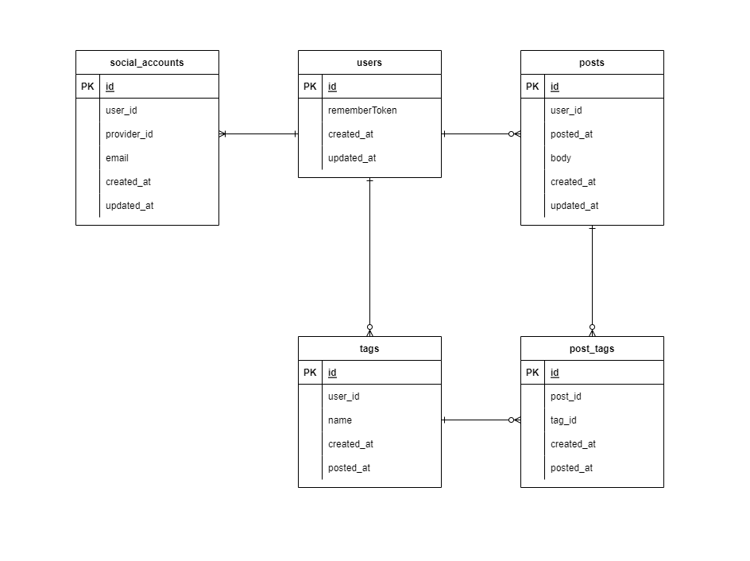

# Dayvo

## 背景
ふと自分の生活について思い返してみると、日々、何をして、何を考えていたのかよく覚えていないことに気づきました。
それを物悲しく感じたため、日記をつけようと考えました。
日記を書く媒体を選ぶにあたって以下の点を重視しました。

- PC、スマホのどちらからでも使える
- 不特定多数への公開を前提としていない
- 検索ができる
- 多機能ではない

これらの特徴を満たすサービスのうち、使いやすいものが見つからなかったため、自分で作ることにしました。

## 機能
- 日記の作成、編集
- タグの作成、編集
- オプションを用いた日記の検索
- Googleアカウントを用いた認証
- 連携するGoogleアカウントの追加、削除
- （DropboxへのDBのバックアップ）

## 使用技術

### フロントサイド
- HTML / SCSS / JavaScript

### サーバーサイド
- PHP / Laravel

### インフラ
- Docker / Docker Compose
- nginx
- MySQL
- ConoHa VPS

## DB設計

||
|:-:|
